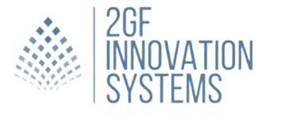

 

# 2GF Innovation Systems

## Sobre Nós
A 2GF Innovation Systems é uma empresa líder no fornecimento de soluções tecnológicas avançadas, focada em otimizar operações e impulsionar a transformação digital em diversos setores industriais e urbanos. Com uma abordagem centrada no cliente, combinamos expertise técnica com um profundo entendimento das necessidades específicas de cada mercado. Nosso objetivo é capacitar nossos clientes a serem mais competitivos, eficientes e sustentáveis através da implementação de soluções inovadoras e eficazes.

## Nossa Visão
Vislumbramos um futuro onde empresas e cidades se beneficiem plenamente das vantagens das tecnologias digitais, tornando-se mais inteligentes, ágeis e sustentáveis. Acreditamos que a transformação digital não é apenas uma necessidade, mas uma oportunidade para inovar e prosperar em um ambiente de negócios dinâmico e desafiador. Estamos empenhados em ser um catalisador de mudanças positivas, impulsionando nossos clientes a alcançar novos patamares de excelência e competitividade global.

## Serviços

### Indústria Inteligente
Em um mundo onde os custos operacionais são cada vez mais influenciados pela disponibilidade e eficiência dos recursos, nossas soluções para Indústria Inteligente são projetadas para maximizar a eficiência operacional e reduzir desperdícios. Oferecemos:

- Sensores Avançados: Implementação de tecnologias de sensoriamento avançadas para monitoramento contínuo e em tempo real de variáveis críticas de processo.
- Integração ERP: Conexão de sistemas empresariais para melhorar a integração de dados e a eficiência operacional.
- Big Data e Análise Preditiva: Utilização de grandes volumes de dados para insights preditivos e otimização de processos.
-  Inteligência de Negócios: Ferramentas e plataformas analíticas para tomada de decisões estratégicas baseadas em dados.
- Certificação Energética e Sustentabilidade: Apoio na obtenção de certificações energéticas e implementação de práticas sustentáveis para redução do impacto ambiental.
- Consultoria Especializada: Assessoria especializada para suporte na tomada de decisões estratégicas e operacionais.

### Transformação Digital
A transformação digital é essencial para empresas que buscam não apenas sobreviver, mas prosperar em um mercado global competitivo. Nossos serviços de Transformação Digital abrangem:

- Engenharia de Software Personalizada: Desenvolvimento de soluções de software personalizadas e escaláveis que atendem às necessidades específicas de cada cliente.
- Automação de Processos: Implementação de sistemas automatizados para aumentar a eficiência operacional, reduzir custos e melhorar a precisão.
- Gestão de Projetos e Implantação: Gerenciamento completo de projetos, desde o planejamento inicial até a implementação e manutenção de soluções tecnológicas.
- Consultoria Estratégica em TI: Orientação especializada para alinhar a estratégia de tecnologia da informação com os objetivos de negócio do cliente.
- Terceirização de Serviços de TI: Fornecimento de profissionais qualificados e especializados para complementar equipes internas e acelerar a entrega de projetos.

### Cidades Inteligentes
Nosso compromisso com o desenvolvimento sustentável e eficiente de cidades se reflete em nossas soluções para Cidades Inteligentes:

- Internet das Coisas (IoT): Implantação de infraestrutura IoT para melhorar a conectividade e eficiência dos serviços urbanos, como iluminação pública inteligente, gestão de resíduos e monitoramento de tráfego.
- Espaços de Dados Verdes: Desenvolvimento de soluções de armazenamento de dados ecologicamente sustentáveis, contribuindo para a redução da pegada de carbono.
- Agricultura de Precisão: Aplicação de tecnologias avançadas para aumentar a produtividade agrícola e promover práticas agrícolas sustentáveis, como monitoramento de culturas e gestão hídrica.
- Consultoria em Cidades Inteligentes: Assessoria estratégica para governos locais na implementação de tecnologias que promovem eficiência energética, mobilidade urbana sustentável e qualidade de vida para os cidadãos.

## Por que nos Escolher?
Na 2GF Innovation Systems, estamos comprometidos em oferecer soluções tecnológicas de ponta que não apenas atendem às necessidades atuais de nossos clientes, mas também antecipam e respondem aos desafios futuros. Nossa abordagem colaborativa e orientada para resultados garante que cada projeto seja realizado com excelência técnica e impacto tangível. Estamos aqui para ajudar nossos clientes a transformarem suas visões em realidade, capacitando-os a alcançar novos patamares de sucesso e sustentabilidade em um mundo digitalmente conectado.